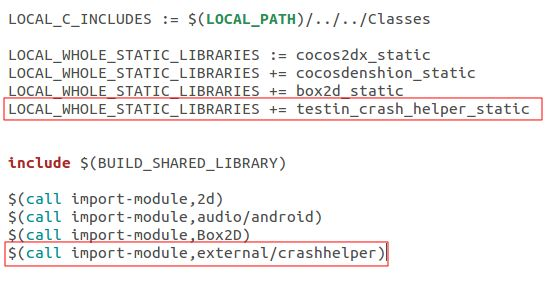
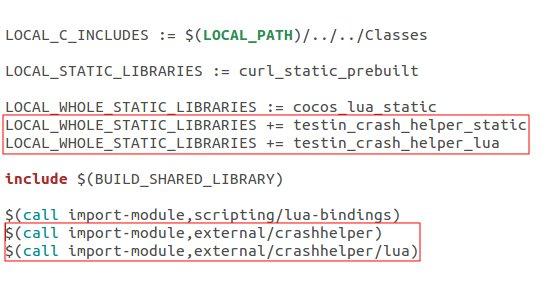
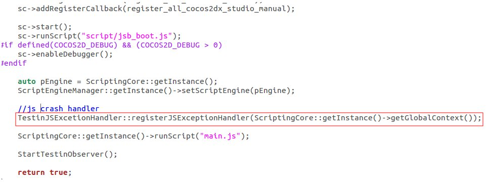

崩溃收集支持
============

崩溃收集支持插件for Cocos引擎，是C++代码到Native代码（Java/ObjectiveC）的桥梁，方便在C++调用Testin崩溃分析SDK，用于传递自定义用户信息、场景、错误等；实现对JavaScript、Lua脚本的错误收集
**注意：在使用本插件前，须确保Testin的崩溃分析SDK已加入到工程中，否则调用时会崩溃。**
**要求的崩溃分析SDK版本：Android 1.7，或iOS 1.4**

- [添加支持](#integration)
- [自定义用户信息](#setuserinfo)
- [自定义错误](#customize)
- [脚本错误收集](#scriptexception)
	- [Lua脚本错误收集](#luaexception)
	- [JavaScript脚本错误收集](#jsexception)

## <a name="integration"/>如何添加代码支持
-----------

请选择您的开发语言

- [C++](#c)
- [Lua](#lua)
- [JavaScript](#javascript)


#### C++
-----------

###### Andriod

修改proj.android/jni目录下的Android.mk文件，增加如下两行

```MK
#这一行需要同其他的LOCAL_WHOLE_STATIC_LIBRARIES命令放在一起
LOCAL_WHOLE_STATIC_LIBRARIES += testin_crash_helper_static 

#这一行放在最后
$(call import-module,external/crashhelper) 
```



###### iOS

在XCode中，将crashhelper目录下的源文件和头文件加入到cocos2d_libs子项目中，如图


另外需要将源文件同时添加到target的Compile Sources中，否则会报ld错误。可以在如下图所示的设置中查看是否添加，如果没有可以点下面的“+”按钮添加


#### Lua
-----------

###### Andriod
修改proj.android/jni目录下的Android.mk文件，增加如下行

```MK
#这两行需要同其他的LOCAL_WHOLE_STATIC_LIBRARIES命令放在一起
LOCAL_WHOLE_STATIC_LIBRARIES += testin_crash_helper_static 
LOCAL_WHOLE_STATIC_LIBRARIES += testin_crash_helper_lua

#这两行放在最后
$(call import-module,external/crashhelper) 
$(call import-module,external/crashhelper/lua) 
```



###### iOS

在XCode中，将crashhelper目录和lua子目录下的源文件和头文件加入到cocos2d_lua_bindings子项目中，如图


另外需要将源文件同时添加到target的Compile Sources中，否则会报ld错误。可以在如下图所示的设置中查看是否添加，如果没有可以点下面的“+”按钮添加


#### JavaScript
-----------

###### Andriod
修改proj.android/jni目录下的Android.mk文件，增加如下行

```MK
#这两行需要同其他的LOCAL_WHOLE_STATIC_LIBRARIES命令放在一起
LOCAL_WHOLE_STATIC_LIBRARIES += testin_crash_helper_static 
LOCAL_WHOLE_STATIC_LIBRARIES += testin_crash_helper_js

#这两行放在最后
$(call import-module,external/crashhelper) 
$(call import-module,external/crashhelper/js) 
```


###### iOS

在XCode中，将crashhelper目录和js子目录下的源文件和头文件加入到cocos2d_js_bindings子项目中，如图


另外需要将源文件同时添加到target的Compile Sources中，否则会报ld错误。可以在如下图所示的设置中查看是否添加，如果没有可以点下面的“+”按钮添加


## <a name="setuserinfo"/>自定义用户信息
-----------
- 添加头文件
在需要使用本插件的C++代码中添加头文件
```C++
#include "crashhelper/TestinCrashHelper.h"

//如果编译过程中找不到头文件，需要把external目录添加到头文件搜索目录中，例如
LOCAL_C_INCLUDES += $(LOCAL_PATH)/../../cocos2d/external
```

- 调用
```C++
//调用下面的C++静态方法设置用户信息
void TestinCrashHelper::setUserInfo(const char* userInfo);

//例如
TestinCrashHelper::setUserInfo("test user info");
```


## <a name="customize"/>自定义错误
-----------
- 添加头文件
在需要使用本插件的C++代码中添加头文件
```C++
#include "crashhelper/TestinCrashHelper.h"

//如果编译过程中找不到头文件，需要把external目录添加到头文件搜索目录中，例如
LOCAL_C_INCLUDES += $(LOCAL_PATH)/../../cocos2d/external
```

- 调用
```C++
//在捕获到自定义错误时（比如自己捕获的异常或者其他错误），调用下面的C++静态方法
//traceback中传递详细信息，如果需要多行可以用\n隔开
void TestinCrashHelper::reportException(int type, const char* reason, const char* traceback);

//例如
TestinCrashHelper::reportException(1, "test reason", "test message");
```

## <a name="scriptexception"/>脚本错误收集
-----------

#### <a name="luaexception"/>Lua错误收集
-----------
- 添加头文件
在初始化Lua引擎的cpp文件中添加头文件
```C++
#include "crashhelper/lua/TestinLuaExceptionHandler.h"

//如果编译过程中找不到头文件，需要把external目录添加到头文件搜索目录中，例如
LOCAL_C_INCLUDES += $(LOCAL_PATH)/../../cocos2d/external
```

- 注册Lua崩溃收集handler（C++）
```C++
//这一行加到Lua引擎的executeScriptFile方法之前
TestinLuaExceptionHandler::registerLuaExceptionHandler();
```


- Lua脚本增加调用C++方法
在Lua主程序的错误回调函数中，调用C++方法把错误传递给C++代码
```C++
//方法定义
onLuaException(const char* reason, const char* traceback);


//例如，在调用xpcall函数时，注册了回调函数__G__TRACKBACK__
xpcall(main, __G__TRACKBACK__)

//在回调函数中，执行onLuaException函数，把错误内容和堆栈传递给C++
function __G__TRACKBACK__(msg)
    print("----------------------------------------")
    print("LUA ERROR: " .. tostring(msg) .. "\n")
    print(debug.traceback())
    --call c++ function
    onLuaException(tostring(msg), debug.traceback())
    print("----------------------------------------")
end
```


#### <a name="jsexception"/>JavaScript错误收集
-----------
- 添加头文件
在初始化JS引擎的cpp文件中添加头文件
```C++
#include "crashhelper/js/TestinJSExceptionHandler.h"

//如果编译过程中找不到头文件，需要把external目录添加到头文件搜索目录中，例如
LOCAL_C_INCLUDES += $(LOCAL_PATH)/../../cocos2d/external
```

- 注册JS崩溃收集handler（C++）
```C++
//方法定义
void TestinJSExcetionHandler::registerJSExceptionHandler(JSContext *cx);

//在JS引擎初始化成功后（在JS引擎的runScript方法之前），调用此方法，将引擎的context作为对象传入，例如：
TestinJSExcetionHandler::registerJSExceptionHandler(ScriptingCore::getInstance()->getGlobalContext());
```




