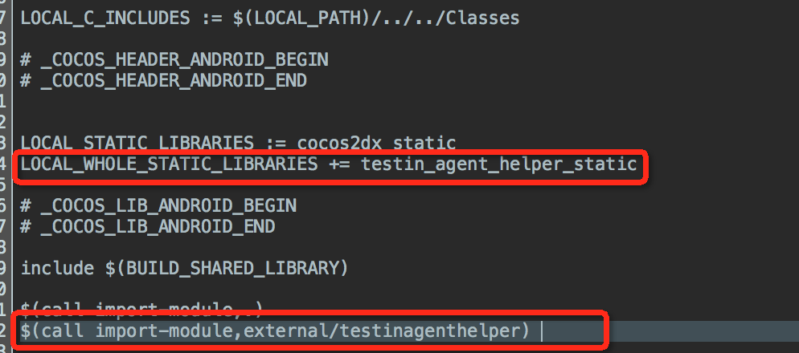
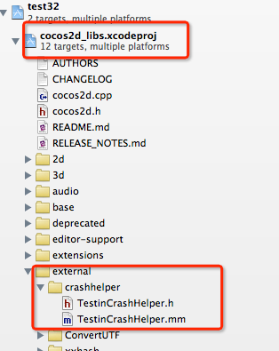
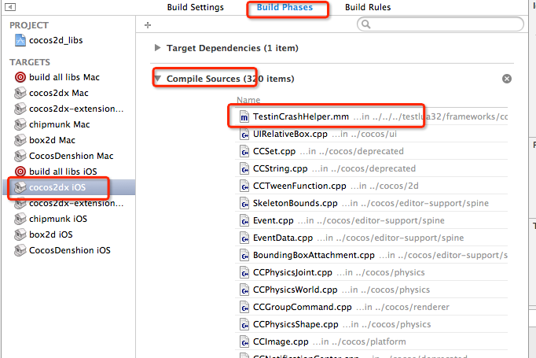
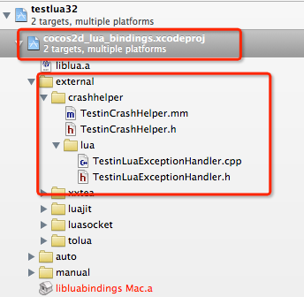
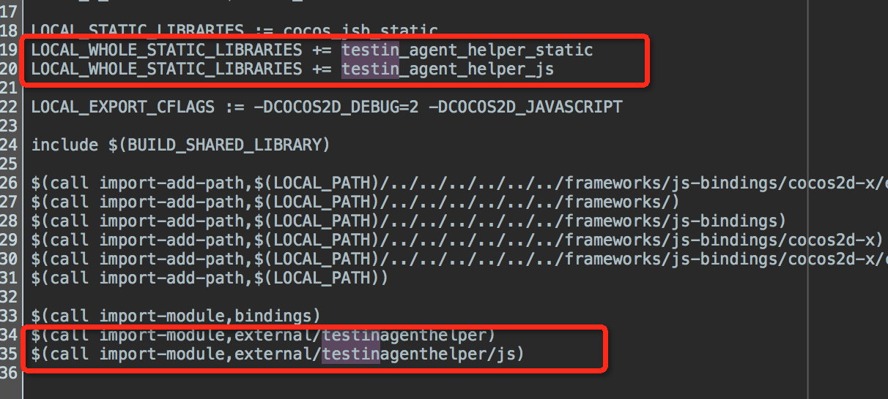
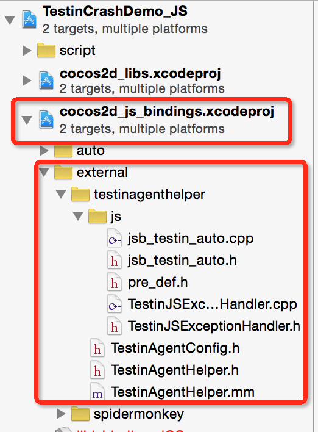
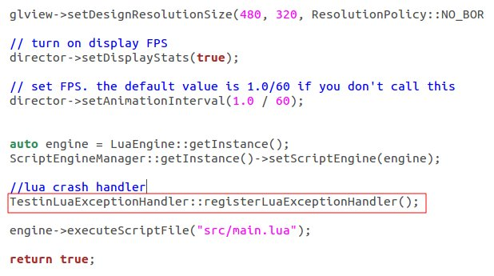
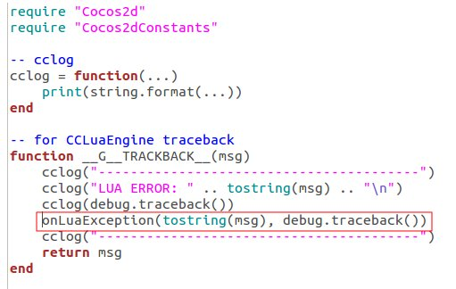

TestinAgent SDK cocos插件支持
============

TestinAgent SDK 插件for Cocos引擎，是C++代码到Native代码（Java/ObjectiveC）的桥梁，方便在C++调用TestinAgent SDK，用于传递自定义用户信息、场景、错误等；实现对JavaScript、Lua脚本的错误收集

**注意：在使用本插件前，须确保TestinAgent SDK已加入到工程中，否则调用时会崩溃。**

**要求的TestinAgent SDK版本：Android/iOS 2.0.0**

- [添加支持](#integration)
- [在引擎代码中初始化](#init)
- [自定义用户信息](#setuserinfo)
- [自定义错误](#customize)
- [脚本错误收集](#scriptexception)
	- [Lua脚本错误收集](#luaexception)
	- [JavaScript脚本错误收集](#jsexception)
- [面包屑功能](#leaveBreadcrumb)
	- [C++中设置面包屑](#c++Breadcrumb)
	- [Lua脚本中设置面包屑](#luaBreadcrumb)
	- [JS脚本中设置面包屑](#jsBreadcrumb)

## <a name="integration"/>如何添加代码支持
-----------

请选择您的开发语言

- [C++](#c)
- [Lua](#lua)
- [JavaScript](#javascript)


#### C++
-----------

###### Andriod

修改proj.android/jni目录下的Android.mk文件，增加如下两行

```MK
#这一行需要同其他的LOCAL_WHOLE_STATIC_LIBRARIES命令放在一起
LOCAL_WHOLE_STATIC_LIBRARIES += testin_agent_helper_static 

#这一行放在最后
$(call import-module,external/testinagenthelper) 
```

示例图片：



###### iOS

在XCode中，将testinagenthelper目录下的源文件和头文件加入到cocos2d_libs子项目中，如图



另外需要将源文件同时添加到target的Compile Sources中，否则会报ld错误。可以在如下图所示的设置中查看是否添加，如果没有可以点下面的“+”按钮添加



#### Lua
-----------

###### Andriod
修改proj.android/jni目录下的Android.mk文件，增加如下行

```MK
#这两行需要同其他的LOCAL_WHOLE_STATIC_LIBRARIES命令放在一起
LOCAL_WHOLE_STATIC_LIBRARIES += testin_agent_helper_static 
LOCAL_WHOLE_STATIC_LIBRARIES += testin_agent_helper_lua

#这两行放在最后
$(call import-module,external/testinagenthelper) 
$(call import-module,external/testinagenthelper/lua) 
```

示例图片：


###### iOS

在XCode中，将testinagenthelper目录和lua子目录下的源文件和头文件加入到cocos2d_lua_bindings子项目中，如图



另外需要将源文件同时添加到target的Compile Sources中，否则会报ld错误。可以在如下图所示的设置中查看是否添加，如果没有可以点下面的“+”按钮添加


#### JavaScript
-----------

###### Andriod
修改proj.android/jni目录下的Android.mk文件，增加如下行

```MK
#这两行需要同其他的LOCAL_WHOLE_STATIC_LIBRARIES命令放在一起
LOCAL_WHOLE_STATIC_LIBRARIES += testin_agent_helper_static 
LOCAL_WHOLE_STATIC_LIBRARIES += testin_agent_helper_js

#这两行放在最后
$(call import-module,external/testinagenthelper) 
$(call import-module,external/testinagenthelper/js) 
```

示例图片：



###### iOS

在XCode中，将testinagenthelper目录和js子目录下的源文件和头文件加入到cocos2d_js_bindings子项目中，如图


另外需要将源文件同时添加到target的Compile Sources中，否则会报ld错误。可以在如下图所示的设置中查看是否添加，如果没有可以点下面的“+”按钮添加


## <a name="init"/>在引擎代码中初始化

为了更方便的使用TestinAgent SDK服务，可以在cocos引擎代码中初始化，无需去Native代码（Java/Objc）中添加如下方法：

```C++
//方法定义，其中appKey为必填，在Testin网站上申请得到；channel为可选，没有此参数时可以填NULL
static void initTestinAgent(const char* appKey, const char* channel);

//例如，在引擎初始化的代码位置（如AppDelegate.cpp的applicationDidFinishLaunching()函数的最前面），添加如下代码行
TestinAgentHelper::initTestinAgent("<yourAppKey>", "<yourChannel>");
```

或者直接修改TestinAgentConfig.h文件中的配置，然后使用如下方法初始化：

```C++
//方法定义，该方法初始化时，会根据TestinAgentConfig.h文件中的配置进行设置TestinAgent SDK的初始化参数。
//该方法目前只支持Android
static void initTestinAgent();

//例如，在引擎初始化的代码位置（如AppDelegate.cpp的applicationDidFinishLaunching()函数的最前面），添加如下代码行
TestinAgentHelper::initTestinAgent();
```

**需要注意：尽管无需在Native代码中初始化，但是仍然需要将Testin Agent的SDK添加到工程：Android工程，需要将TestinAgent.jar拷贝至工程的libs目录；iOS工程，需要添加TestinAgent.Framework**

## <a name="setuserinfo"/>自定义用户信息
-----------
- 添加头文件
在需要使用本插件的C++代码中添加头文件
```C++
#include "testinagenthelper/TestinAgentHelper.h"

//如果编译过程中找不到头文件，需要把external目录添加到头文件搜索目录中，例如
LOCAL_C_INCLUDES += $(LOCAL_PATH)/../../cocos2d/external
```

- 调用
```C++
//调用下面的C++静态方法设置用户信息
static void setUserInfo( const char* userInfo );

//例如
TestinAgentHelper::setUserInfo("test user info");
```


## <a name="customize"/>自定义错误
-----------
- 添加头文件
在需要使用本插件的C++代码中添加头文件
```C++
#include "testinagenthelper/TestinAgentHelper.h"

//如果编译过程中找不到头文件，需要把external目录添加到头文件搜索目录中，例如
LOCAL_C_INCLUDES += $(LOCAL_PATH)/../../cocos2d/external
```

- 调用
```C++
//在捕获到自定义错误时（比如自己捕获的异常或者其他错误），调用下面的C++静态方法
//traceback中传递详细信息，如果需要多行可以用\n隔开
static void TestinAgentHelper::reportException(int type, const char* reason, const char* traceback);

//例如
TestinAgentHelper::reportException(1, "test reason", "test message");
```

## <a name="scriptexception"/>脚本错误收集
-----------

#### <a name="luaexception"/>Lua错误收集
-----------
- 添加头文件
在初始化Lua引擎的cpp文件中添加头文件
```C++
#include "testinagenthelper/lua/TestinLuaExceptionHandler.h"

//如果编译过程中找不到头文件，需要把external目录添加到头文件搜索目录中，例如
LOCAL_C_INCLUDES += $(LOCAL_PATH)/../../cocos2d/external
```

- 注册Lua崩溃收集handler（C++）
```C++
//这一行加到Lua引擎的executeScriptFile方法之前
TestinLuaExceptionHandler::registerLuaExceptionHandler();
```

示例：



- Lua脚本增加调用C++方法
在Lua主程序的错误回调函数中，调用C++方法把错误传递给C++代码
```C++
//方法定义
static int onLuaException(const char* reason, const char* traceback);


//例如，在调用xpcall函数时，注册了回调函数__G__TRACKBACK__
xpcall(main, __G__TRACKBACK__)

//在回调函数中，执行onLuaException函数，把错误内容和堆栈传递给C++
function __G__TRACKBACK__(msg)
    print("----------------------------------------")
    print("LUA ERROR: " .. tostring(msg) .. "\n")
    print(debug.traceback())
    --call c++ function
    onLuaException(tostring(msg), debug.traceback())
    print("----------------------------------------")
end
```

示例图片：



#### <a name="jsexception"/>JavaScript错误收集
-----------
- 添加头文件
在初始化JS引擎的cpp文件中添加头文件
```C++
#include "testinagenthelper/js/TestinJSExceptionHandler.h"

//如果编译过程中找不到头文件，需要把external目录添加到头文件搜索目录中，例如
LOCAL_C_INCLUDES += $(LOCAL_PATH)/../../cocos2d/external
```

- 注册JS崩溃收集handler（C++）
```C++
//方法定义
static void registerJSExceptionHandler(JSContext *cx);

//在JS引擎初始化成功后（在JS引擎的runScript方法之前），调用此方法，将引擎的context作为对象传入，例如：
TestinJSExcetionHandler::registerJSExceptionHandler(ScriptingCore::getInstance()->getGlobalContext());
```

示例图片：


## <a name="leaveBreadcrumb"/>面包屑功能

TestinAgent SDK提供了面包屑功能，方便开发者在解决Crash或者异常的时候，还原用户的真实操作流程。当然，开发者可以在C++以及JS、Lua脚本中设置面包屑，具体步骤如下：

-----------

#### <a name="c++Breadcrumb"/>C++中设置面包屑
-----------

- 添加头文件
在需要使用本插件的C++代码中添加头文件
```C++
#include "testinagenthelper/TestinAgentHelper.h"

//如果编译过程中找不到头文件，需要把external目录添加到头文件搜索目录中，例如
LOCAL_C_INCLUDES += $(LOCAL_PATH)/../../cocos2d/external
```

- 调用
```C++
//方法定义，其中breadcrumb为设置的面包屑
static void leaveBreadcrumb( const char* breadcrumb );

//例如
TestinAgentHelper::leaveBreadcrumb("init sccussed");
```

#### <a name="luaBreadcrumb"/>Lua脚本中设置面包屑
-----------

- 调用
```C++
//方法定义
static int leaveBreadcrumb(lua_State* ls);

//直接在lua脚本中调用，如下：
leaveBreadcrumb("click")
```

#### <a name="jsBreadcrumb"/>JS脚本中设置面包屑
-----------

- 在AppDelegate.cpp中添加头文件

```C++
#include "testinagenthelper/js/jsb_testin_auto.cpp"

```
- 注册回调函数（在ScriptingCore::getInstance()->start()执行之前注册）

```C++
sc->addRegisterCallback(register_jsb_testin_all);

```

- 在JS脚本中设置面包屑

```C++
testinLeaveBreadcrumb("game.onStart")；

```